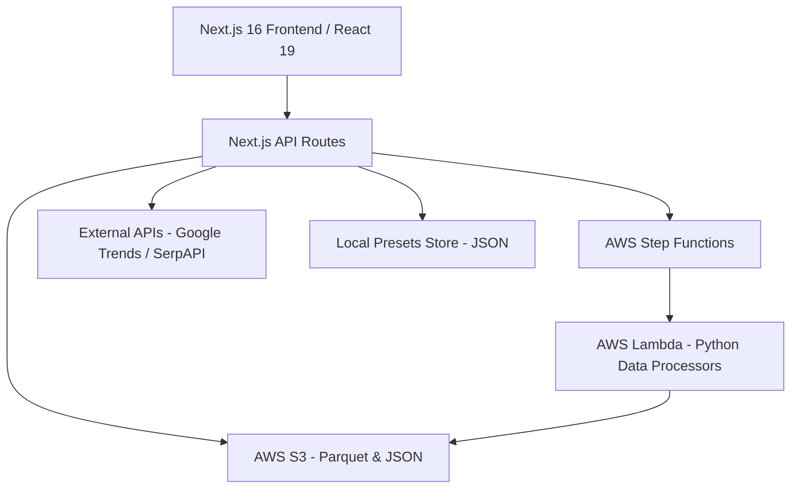

# ATAI Hybrid Dashboard

A comprehensive Next.js 16 (App Router) hybrid dashboard and backend orchestration layer for the ATAI product sourcing pipeline. It integrates with AWS infrastructure (Step Functions, Lambda, S3) to discover, rank, and analyze products from multiple sources like Amazon and Alibaba using Parquet-backed datasets.

## 🌟 Core Features

### 1. Hybrid Dashboard UI
- **Unified Interface**: A high-performance dashboard (`src/app/dashboard.tsx`) for managing search operations and visualizing product rankings.
- **Real-time Monitoring**: Track the progress of product sourcing pipelines with live status updates.
- **Search Presets**: Save and load complex search configurations (keywords, filters, source-specific settings) into local storage slots.
- **Authentication**: Secure entry via a persistent session management system.

### 2. Product Sourcing Pipeline
- **AWS Orchestration**: Triggers and manages multi-stage AWS Step Functions for deep product discovery.
- **Multi-Source Support**: Ranked results consolidated from Amazon, Alibaba, and other major marketplaces.
- **Smart Filtering**: Advanced filters for pricing, reviews, ratings, margins (Cost Below %), and supplier verification.

### 3. Keyword & Trend Intelligence
- **Keyword Discovery**: Integrated keyword generation using SerpAPI and Google Trends.
- **Data-Driven Ranking**: Products are scored based on search volume, trend interest, and competitive density.

### 4. System Governance
- **Discovery Criteria**: CRUD-based management of sourcing logic and discovery rules stored in S3.
- **Debugging & Logging**: Environment sanity checks (`/api/debug-env`) and centralized server-side logging.

---

## 🏗️ Project Architecture



---

## 🚀 Setup & Local Development

1. **Prerequisites**
   - Node.js 18+ (Node 20+ recommended)
   - AWS CLI configured with appropriate permissions.

2. **Installation**
   ```bash
   npm install
   ```

3. **Configuration**
   Create a `.env.local` file based on the environment structure below:
   ```env
   # AWS infrastructure
   AWS_REGION=eu-north-1
   AWS_ACCESS_KEY_ID=your_key
   AWS_SECRET_ACCESS_KEY=your_secret

   # S3 Storage
   S3_RANKED_BUCKET=atai-result-data
   S3_RANKED_KEY=ranked/manual_search/ranked_results.parquet
   S3_CONFIG_BUCKET=atai-config
   S3_CRITERIA_KEY=discovery_criteria.json

   # Orchestration
   STEP_FUNCTION_ARN=arn:aws:states:...
   CRITERIA_EVALUATOR_FUNCTION=your-lambda-arn

   # Application
   APP_PASSWORD=your_secure_password
   SERPAPI_KEY=your_key
   ```

4. **Running Locally**
   ```bash
   # Development mode
   npm run dev

   # Build & Start
   npm run build
   npm start
   ```

---

## 🛠️ API Documentation

### 🔐 Authentication
- `POST /api/auth/login`: Authenticates user via `APP_PASSWORD` and sets a secure HttpOnly cookie.
- `DELETE /api/auth/login`: Clears the session cookie.

### 📂 Search Presets
- `GET /api/presets`: Retrieves all saved search presets.
- `POST /api/presets`: Saves or renames presets (Actions: `save_new`, `rename`).
- `DELETE /api/presets`: Deletes a preset slot by ID.

### 🍱 Product Data
- `GET /api/products`: Fetches ranked product results from S3. Supports extensive filtering for Amazon (price, reviews, ratings) and Alibaba (margins, MOQ, supplier scores).
- `GET /api/criteria`: Manages the discovery criteria configuration.

### 🔄 Pipeline Orchestration
- `POST /api/pipeline/trigger`: Initiates a new Step Functions execution for a specific keyword or category.
- `GET /api/pipeline/status`: Checks the current execution status of an ARN.
- `POST /api/pipeline/stop`: Aborts a running pipeline execution.
- `GET /api/pipeline/preliminary`: Fetches early-stage results while the full pipeline is still running.

### 📈 Trends & Keywords
- `GET /api/trends/related-queries`: Discovers trending keywords and related queries for a given category.

---

## 📦 Key Technologies

- **Frontend**: React 19, Tailwind CSS v4, Lucide Icons, Framer Motion.
- **Backend Framework**: Next.js 16.1.1 (App Router).
- **Data Processing**: `hyparquet` (Parquet parsing), `xlsx` (Excel integration).
- **Cloud Integration**: AWS SDK v3 (@aws-sdk/client-s3, client-sfn, client-lambda).
- **Python Backend (AWS Functions)**: Python 3.9+ for Lambda-based data cleaning and extraction.

## 📂 Source Structure

- `/src/app`: Application pages and API routes.
- `/src/lib`: Core services (S3, Step Functions, Product Services).
- `/aws_functions`: Source code for AWS Lambda processors.
- `/data`: Local cache and persistent storage for presets.
- `/logs`: Server-side execution logs.
